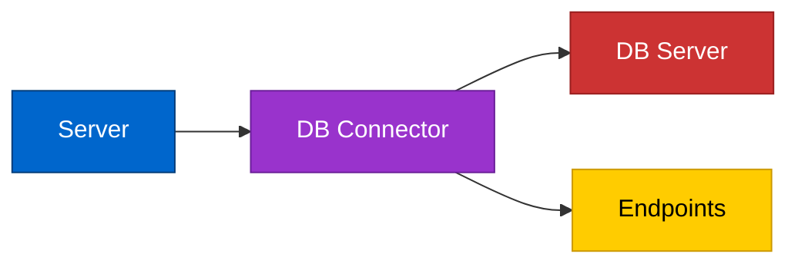

# Getting Started

## Network Architecture



The DB Connector is deployed on the server and configured to connect to the database server. Once configured, the DB Connector automatically generates API endpoints that expose database query results, enabling seamless integration with Webexcc.

### External Access Flow


Webex Contact Center invokes the generated endpoints to retrieve real-time data from your database. To ensure secure communication, configure your firewall or load balancer to allow incoming requests only from Webex Contact Center's whitelisted IP addresses.

**Security Configuration:** For the complete list of whitelisted IP addresses and security setup instructions, refer to the official [Webex Contact Center Security Documentation](https://help.webex.com/en-us/article/3srgv1/Set-up-security-for-Webex-Contact-Center#Cisco_Task_in_List_GUI.dita_2de9d95e-9195-4abb-afe0-cef74f18d9cc).

## Quick Start Guide

### Prerequisites

Before you begin, ensure you have the following installed on your system:

- **Java Development Kit (JDK) 24** or later
- **Git** for cloning the repository
- A text editor or IDE (Visual Studio Code, IntelliJ IDEA, or Eclipse recommended)

### Step 1: Download the Project

Clone the repository to your local machine using Git:

```bash
git clone https://github.com/CiscoDevNet/webex-contact-center-dbconnector.git
cd webex-contact-center-dbconnector/com.cisco.webexcc.dbconnector
```

Alternatively, download the ZIP file from the [repository](https://github.com/CiscoDevNet/webex-contact-center-dbconnector/tree/main/com.cisco.webexcc.dbconnector) and extract it to your desired location.

### Step 2: Configure Application Properties

Edit the `application.properties` file located at:

```
src/main/resources/application.properties
```

Update the database connection settings and other configuration values as needed for your environment.

### Step 3: Compile the Application

Compile the project using the included Maven wrapper (no separate Maven installation required):

**On macOS/Linux:**
```bash
./mvnw clean install
```

**On Windows:**
```bash
mvnw.cmd clean install
```

This command will:
- Download all required dependencies
- Compile the source code
- Run tests
- Package the application into a JAR file

The compiled JAR file will be created in the `target/` directory.

### Step 4: Run the Application

Once compilation is complete, start the application using one of these methods:

**Option 1: Using Maven (Recommended for Development)**
```bash
./mvnw spring-boot:run
```

**Option 2: Using the JAR File**
```bash
java -jar target/com.cisco.webexcc.dbconnector-<version>.jar
```

**Option 3: Using VS Code**
- Open the project in VS Code
- Use the built-in task: "Run Spring Boot App"

### Step 5: Verify the Application

Once started, the application will be accessible at:

```
http://localhost:8080
```

You should see the application home page. Check the console output for any errors or warnings.

### Common Configuration Tips

**Database Drivers:**
- Ensure the appropriate JDBC driver is included in your `pom.xml` dependencies
- Common drivers: MySQL, PostgreSQL, Oracle, SQL Server

**Environment-Specific Configuration:**
- Create separate property files for different environments:
  - `application-dev.properties` for development
  - `application-prod.properties` for production
- Activate profiles using: `./mvnw spring-boot:run -Dspring-boot.run.profiles=dev`

**Troubleshooting:**
- If compilation fails, verify your Java version: `java -version`
- Check that port 8080 is not already in use
- Ensure database server is running and accessible
- Review application logs in the console for detailed error messages

## Running the application

To run the application, use the following command:

```bash
./mvnw spring-boot:run
```

Or use the VS Code task "Run Spring Boot App".

### Reference Documentation
For further reference, please consider the following sections:

* [Official Apache Maven documentation](https://maven.apache.org/guides/index.html)
* [Spring Boot Maven Plugin Reference Guide](https://docs.spring.io/spring-boot/4.0.0/maven-plugin)
* [Create an OCI image](https://docs.spring.io/spring-boot/4.0.0/maven-plugin/build-image.html)
* [Spring Web](https://docs.spring.io/spring-boot/4.0.0/reference/web/servlet.html)

### Guides
The following guides illustrate how to use some features concretely:

* [Building a RESTful Web Service](https://spring.io/guides/gs/rest-service/)
* [Serving Web Content with Spring MVC](https://spring.io/guides/gs/serving-web-content/)
* [Building REST services with Spring](https://spring.io/guides/tutorials/rest/)

### Maven Parent overrides

Due to Maven's design, elements are inherited from the parent POM to the project POM.
While most of the inheritance is fine, it also inherits unwanted elements like `<license>` and `<developers>` from the parent.
To prevent this, the project POM contains empty overrides for these elements.
If you manually switch to a different parent and actually want the inheritance, you need to remove those overrides.

