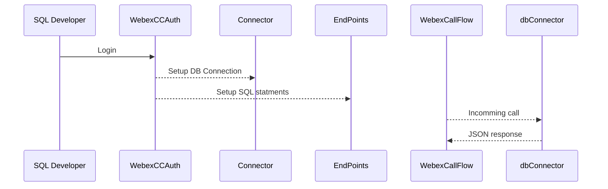

# webexcc-dbconnector-angular

This is a Angular web application that has been written to be the UI front-end to the webexcc-dbconnector-springboot project.

This project was designed and tested to be ran as a:
- Standalone server
- Docker image
- AWS cloud.

The goal of this project is to provide a low code solution to be the administration UI for the webexcc-dbconnector-springboot project. If your company does not have Angular development skill set, then your developers can write their own UI administration page for the webexcc-dbconnector-springboot project.

## Sequence diagram

--- 

# Files
| | | |
|-|-|-|
|Directory|doc|documentation directory|
|Directory|images|repository images|
|Directory|logs|app runtime log files|
|Directory|src/main/java/com/cisco/app/dbconnector/model/|POJOs|
|Directory|src/main/resources/static|place html files here if you want the web server and to run within the same container|
|File|application.yml|application config file is keep in the root folder so it can be modified with having to recompile|
|Config|application.yml.baseURL|https://webexapis.com/v1|
|Config|application.yml.client_id|https://developer.webex-cx.com/my-apps|
|Config|application.yml.client_secret|https://developer.webex-cx.com/my-apps|
|Config|application.yml.redirect_uri|https://developer.webex-cx.com/my-apps|
|Config|application.yml.response_type|https://developer.webex-cx.com/my-apps|
|Config|application.yml.scope|https://developer.webex-cx.com/my-apps|
|Config|application.yml.state|https://developer.webex-cx.com/my-apps|
|Config|application.yml.grant_type|https://developer.webex-cx.com/my-apps|
|Config|application.yml.filesystem.dataDirectory|where to persist config files (encrypted)|
|Config|application.yml.filesystem.fileSystemInterface|fileSystemLocalhost OR fileSystemAWSS3|
|Config|application.yml.fileSystemAWSS3.accessKey|required is using AWS S3 bucket|
|Config|application.yml.fileSystemAWSS3.bucketName|required is using AWS S3 bucket|
|Config|application.yml.fileSystemAWSS3.secretKey|required is using AWS S3 bucket|
|Directory|data|where config data is persist (defined in/application.yml)|
|File|data/007c6d94-c164-4646-a656-ee6b44faf429.obj|this is what a endpoint looks like (encrypted)|
|File|data/BasicAuth.obj|if you have authentication turned on for endpoints this files is used (encrypted)|
|File|data/Connector.obj|active connector's information is stored here (encrypted)|
|File|data/MySql.obj|MySql's connection information is stored here (encrypted)|
|File|data/SqlServer.obj|Sql Server's connection information is stored here (encrypted)|
|File|Dockerfile|used to create a docker image|
|File|HELP.md|todo|
|File|pom.xml|Maven's configuration file|
|File|src/main/resources/application.yml|not used. but you can if you want|
|File|src/test/java/com/cisco/app/dbconnector/DbConnectorTests.java|dbConnector test methods|
|Code|src/main/java/com/cisco/app/dbconnector/controller/WebController.java|used by the UI|
|Code|src/main/java/com/cisco/app/dbconnector/controller/WebControllerRest.java|used by the UI|
|Code|src/main/java/com/cisco/app/dbconnector/controller/WebControllerUI.java|configured for the webexcc-dbconnector-angular project|
|Code|src/main/java/com/cisco/app/dbconnector/controller/WebControllerWebexCC.java|WebexCC endpoints|
|Code|src/main/java/com/cisco/app/dbconnector/DbConnector.java|Spring Boot Main application file|
|Code|src/main/java/com/cisco/app/dbconnector/service/DatabaseUtility.java|utility for SQL commands|
|Code|src/main/java/com/cisco/app/dbconnector/service/FileSystemAWSS3.java|AWS S3 bucket code|
|Code|src/main/java/com/cisco/app/dbconnector/service/FileSystemInterface.java|file system interface|
|Code|src/main/java/com/cisco/app/dbconnector/service/FileSystemLocalhost.java|local host file system code|
|Code|src/main/java/com/cisco/app/dbconnector/util/Convertor.java|convert sql to json|
|Code|src/main/java/com/cisco/app/dbconnector/util/Cypher2021.java|encryption class|
|Code|src/main/java/com/cisco/app/util/Memory.java|logs application memory usage|
|Conf|src/assets/env.json| JSON login config file|
|Conf| src/assets/env.json -> client_id | get value from https://developer.webex-cx.com/my-apps|
|Conf| src/assets/env.json -> redirect_uri | get value from https://developer.webex-cx.com/my-apps|
|Conf| src/assets/env.json -> resourceUrl | FQDN of the springboot server|

## Videos of different configurations 

All on one server - TODO
Two servers - TODO
Docker one image - TODO
Docker two images - TODO

# webexcc-dbconnector-angular
webexcc-dbconnector-angular is the UI project for this application.
For the low code approach, we have provided it for you. 
If you don't have angular skill set, you can write your own UI web pages.

# compile & run

nvm install v14.20 #one time install

nvm use v14.20 #one time install

npm install -g @angular/cli@15.2.8. #one time install

npm install

npm audit fix

ng build

ng serve --open

# add new connector
open terminal
cd to project root directory  (**webexcc-dbconnector-angular**)
> ng generate component connector/oracle

# add new connector page

refer to src/app/connector for connector selections (pulldown)

refer to src/app/connector/oracle for adding connector page

# compile and run (stand alone springboot server)

open terminal 

cd ../webex-contact-center-dbconnector/webexcc-dbconnector-angular

npm i

ng build

-------------------------

delete all files in 

.../webex-contact-center-dbconnector/webexcc-dbconnector-springboot/src/main/resources/static

move all files 

from 

.../webex-contact-center-dbconnector/webexcc-dbconnector-angular/dist

to

.../webex-contact-center-dbconnector/webexcc-dbconnector-springboot/src/main/resources/static

-------------------------

open terminal 

cd .../webex-contact-center-dbconnector/webexcc-dbconnector-springboot

mvn clean install

java -jar target/dbConnectorGitHub-0.0.2.jar

